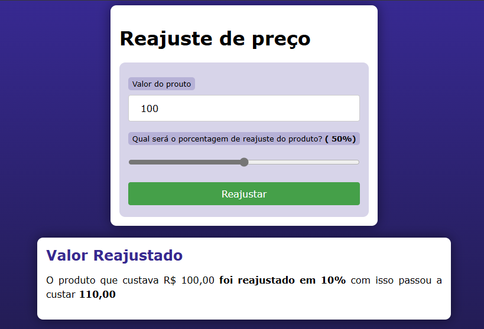

- Atividade de Estudo de PHP - Curso em Vídeo
Este repositório contém o código desenvolvido durante uma atividade prática do curso de PHP do Curso em Vídeo.

Descrição
Neste exercício, foi implementada uma aplicação simples em PHP para calcular o reajuste de preço de um produto com base em um valor e uma porcentagem fornecidos pelo usuário. O objetivo era praticar os conceitos básicos de PHP e formulários HTML.

 - Funcionalidades Implementadas
Entrada de Dados: O usuário pode inserir o valor inicial do produto e escolher a porcentagem de reajuste através de um formulário HTML.
Cálculo de Reajuste: Com base nos valores inseridos, o PHP calcula o novo preço do produto após o reajuste.
Exibição do Resultado: O resultado é apresentado na mesma página, mostrando o valor original do produto, a porcentagem de reajuste aplicada e o novo valor do produto após o reajuste.
Estrutura do Código
HTML e PHP: O código HTML contém o formulário para entrada dos dados e a exibição do resultado, enquanto o PHP processa os dados enviados pelo formulário e realiza os cálculos necessários.
JavaScript: Um script simples em JavaScript foi utilizado para atualizar dinamicamente o valor da porcentagem selecionada pelo usuário.
Ferramentas Utilizadas
PHP: Linguagem utilizada para manipulação e processamento de dados do lado do servidor.
HTML/CSS: Utilizados para a estruturação e estilo da página web.
Curso em Vídeo: O exercício faz parte de um curso prático de PHP oferecido pelo Curso em Vídeo, uma plataforma de ensino online.
Como Utilizar
Clone o Repositório: Clone este repositório para sua máquina local.

 - Abra o Arquivo: Abra o arquivo index.php em seu navegador web.

 - Preencha os Campos: Preencha os campos do formulário com o valor inicial do produto e a porcentagem desejada de reajuste.

- Obtenha o Resultado: Clique no botão "Reajustar" para ver o resultado do cálculo na seção correspondente.

Observações
Este projeto é apenas um exercício didático para aprender os fundamentos básicos de PHP, não sendo recomendado para uso em produção sem a devida adequação e segurança.

Autor
Este exercício foi realizado como parte do curso de PHP do Curso em Vídeo, ministrado pelo professor Gustavo Guanabara.
